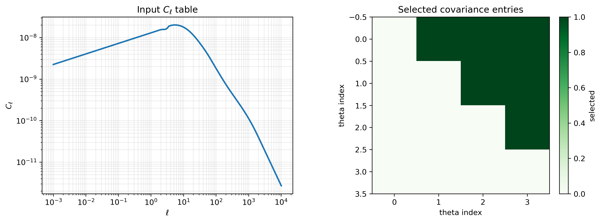
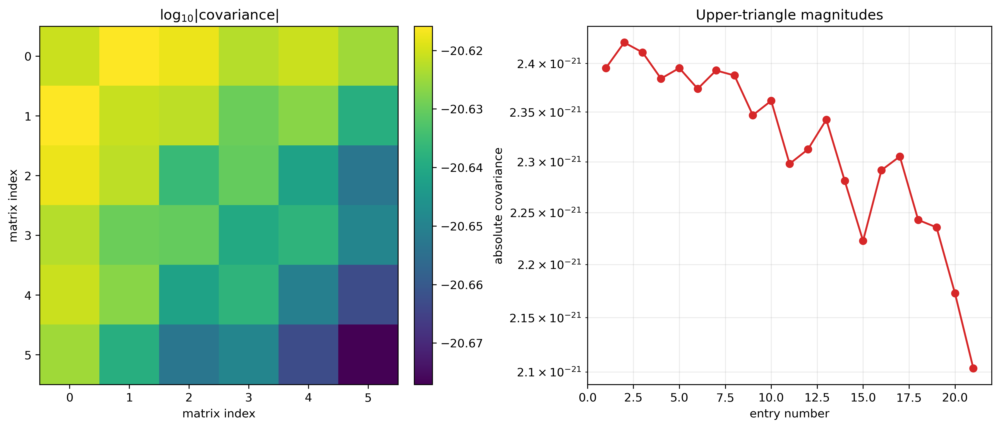
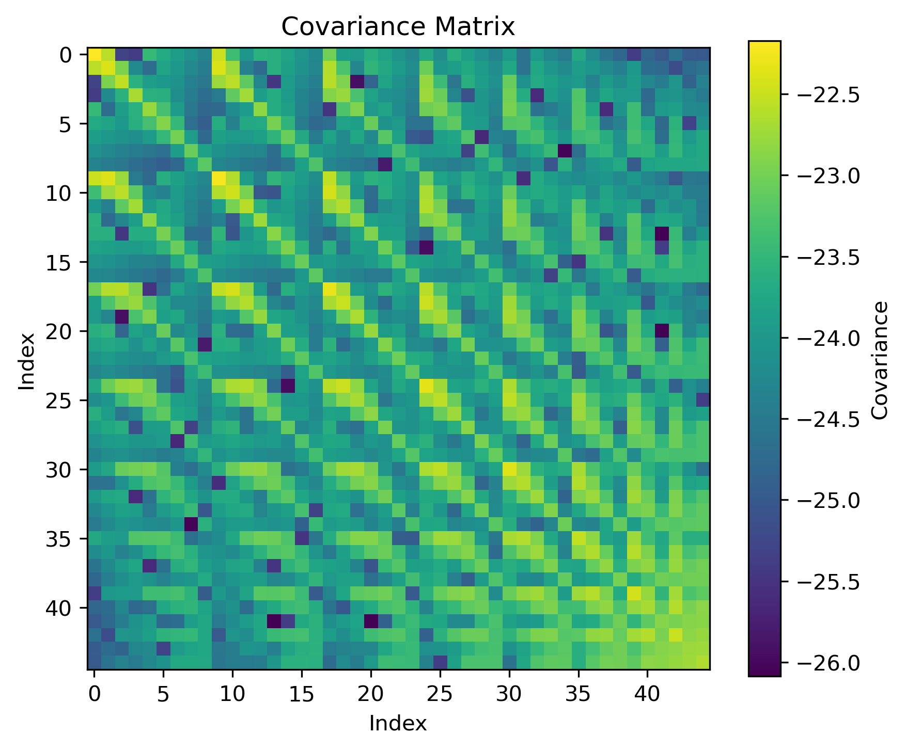

Covariance-Matrix Notebook Workflow
===================================

Run the Published Package in Colab
----------------------------------

.. image:: https://colab.research.google.com/assets/colab-badge.svg
   :target: https://colab.research.google.com/github/sadirs/3ptWL-cov/blob/main/docs/examples/wlcovpy_covariance_colab.ipynb
   :alt: Open the covariance-matrix tutorial in Google Colab

The `version-controlled Colab notebook`_ is the simplest public reproduction
path. It does not require a repository checkout. In a fresh Colab runtime it:

* installs ``build-essential``, ``libgsl-dev``, and ``python3-dev``;
* installs the published ``wlcovpy==1.0.1`` package from PyPI;
* downloads ``Cls_ep2.txt`` and ``theta_array.txt`` from the matching
  ``v1.0.1`` GitHub release tag;
* carries its covariance helper functions directly in the notebook;
* computes and validates the finite, symmetric ``6 x 6`` compact covariance
  matrix;
* saves the numerical matrix and both diagnostic figures in the Colab working
  directory.

The version pin and tagged fixture URLs are intentional: they prevent a later
package or input-file change from silently altering this documented result.
The optional full R2D2 configuration is included but disabled by default
because it performs many more native integrations.

Repository-Local Notebook
-------------------------

This page mirrors the structure of ``tests/notebooks/example.ipynb``.  The
documentation is static, but the sections follow the same order as the
notebook: setup, helper functions, input inspection, covariance calculation,
plotting, and the larger R2D2 reference output.

The notebook uses the convenience functions in
``tests/python/covariance_example.py`` to wrap repeated ``wlcovpy`` calls in
NumPy, then saves diagnostic plots in ``tests/notebooks/plots``.

Unlike the self-contained Colab notebook, this development notebook imports
the helper module and input files directly from the source checkout.

Open the interactive notebook from the repository root after building
``wlcovpy``:

.. prompt:: bash

   jupyter notebook tests/notebooks/example.ipynb

1. Setup
--------

The first cell imports the scientific Python tools, finds the repository root,
adds ``tests/python`` to ``sys.path``, and creates the local plot directory.

.. code-block:: python

   from pathlib import Path
   import os
   import sys

   import matplotlib.pyplot as plt
   import numpy as np

   def find_repo_root(start=Path.cwd()):
       for path in (start, *start.parents):
           if (path / "tests" / "python" / "covariance_example.py").exists():
               return path
       raise RuntimeError("Run this notebook from inside the 3ptWL-cov repository.")

   REPO_ROOT = find_repo_root()
   NOTEBOOK_DIR = REPO_ROOT / "tests" / "notebooks"
   PLOTS_DIR = NOTEBOOK_DIR / "plots"
   PLOTS_DIR.mkdir(parents=True, exist_ok=True)

   sys.path.insert(0, str(REPO_ROOT / "tests" / "python"))
   import covariance_example as cov

   os.chdir(NOTEBOOK_DIR)

   CLS_FILE = REPO_ROOT / "tests" / "input" / "Cls_ep2.txt"
   THETA_FILE = REPO_ROOT / "tests" / "input" / "theta_array.txt"

   print(f"Repository root: {REPO_ROOT}")
   print(f"Plot directory:   {PLOTS_DIR}")

2. Helper Function Map
----------------------

``covariance_example.py`` keeps the notebook short by packaging the repeated
steps:

* ``add_noise_to_column`` writes a temporary noisy ``C_ell`` table;
* ``build_mask`` selects the covariance entries to compute;
* ``get_valid_indices`` converts that mask into index pairs;
* ``calculate_integral`` runs one ``wlcovpy`` calculation;
* ``compute_cov_noise`` assembles the symmetric covariance matrix.

3. Inspect the Inputs
---------------------

``wlcov`` expects a two-column angular power-spectrum table, ``ell`` and
``C_ell``.  The covariance workflow also needs an angular grid.  This compact
example uses the first four angular values so it is fast enough for
documentation and smoke tests.

.. code-block:: python

   ell, cls = np.loadtxt(CLS_FILE, unpack=True)
   theta_all = np.loadtxt(THETA_FILE)

   theta = theta_all[:4]
   rows = 0
   diagonals = 1
   mask = cov.build_mask(dim=len(theta), rows=rows, diagonals=diagonals)

   fig, axes = plt.subplots(1, 2, figsize=(11, 4), constrained_layout=True)

   axes[0].loglog(ell, cls, color="#1f77b4", lw=2)
   axes[0].set_title(r"Input $C_\ell$ table")
   axes[0].set_xlabel(r"$\ell$")
   axes[0].set_ylabel(r"$C_\ell$")
   axes[0].grid(True, which="both", alpha=0.25)

   im = axes[1].imshow(mask, cmap="Greens", interpolation="nearest")
   axes[1].set_title("Selected covariance entries")
   axes[1].set_xlabel("theta index")
   axes[1].set_ylabel("theta index")
   fig.colorbar(im, ax=axes[1], fraction=0.046, pad=0.04, label="selected")

   fig.savefig(PLOTS_DIR / "inputs_and_mask.png", dpi=300, bbox_inches="tight")
   plt.show()

4. Compute a Compact Covariance Matrix
--------------------------------------

The helper adds a small noise term to the input spectrum, runs the covariance
integral for each selected pair of angular scales, and stores the resulting
matrix.  The example uses a low ``ppp`` value because the goal is a quick
documentation workflow, not a convergence-grade production run.

.. code-block:: python

   settings = dict(
       rows=rows,
       diagonals=diagonals,
       dim=len(theta),
       m=0,
       mp=0,
       ppp=4,
       noise=6.1e-11,
   )

   covariance = cov.compute_cov_noise(
       thtdata=theta,
       inputfile=CLS_FILE,
       outputfile=NOTEBOOK_DIR / "analytic_covariance_example.txt",
       **settings,
   )

   temp_file = NOTEBOOK_DIR / "Cls_temp.txt"
   if temp_file.exists():
       temp_file.unlink()

   print(f"Covariance shape: {covariance.shape}")
   print(f"Finite values:    {np.isfinite(covariance).all()}")

The expected compact-example output is:

.. code-block:: text

   Covariance shape: (6, 6)
   Finite values:    True

5. Plot and Save the Result
---------------------------

The main diagnostic plot is saved to
``tests/notebooks/plots/covariance_summary.png``.  The heat map shows
``log10(abs(covariance))``; the right panel shows the magnitude of the
upper-triangle entries.

.. code-block:: python

   abs_cov = np.abs(covariance)
   log_cov = np.full_like(abs_cov, np.nan, dtype=float)
   positive = abs_cov > 0
   log_cov[positive] = np.log10(abs_cov[positive])

   fig, axes = plt.subplots(1, 2, figsize=(12, 5), constrained_layout=True)

   im = axes[0].imshow(log_cov, cmap="viridis", interpolation="nearest")
   axes[0].set_title(r"$\log_{10}|\mathrm{covariance}|$")
   axes[0].set_xlabel("matrix index")
   axes[0].set_ylabel("matrix index")
   fig.colorbar(im, ax=axes[0], fraction=0.046, pad=0.04)

   upper_values = abs_cov[np.triu_indices_from(abs_cov)]
   upper_values = upper_values[upper_values > 0]
   axes[1].semilogy(
       np.arange(1, len(upper_values) + 1),
       upper_values,
       "o-",
       color="#d62728",
       lw=1.6,
   )
   axes[1].set_title("Upper-triangle magnitudes")
   axes[1].set_xlabel("entry number")
   axes[1].set_ylabel("absolute covariance")
   axes[1].grid(True, which="both", alpha=0.25)

   fig.savefig(PLOTS_DIR / "covariance_summary.png", dpi=300, bbox_inches="tight")
   plt.show()

   print(f"Saved: {(PLOTS_DIR / 'covariance_summary.png').relative_to(REPO_ROOT)}")

6. R2D2 Paper-Data Reproduction Workflow
----------------------------------------

The R2D2 workflow reproduces the covariance data used in the original paper.
For this production-reference case, switch to the full theta array and use the
larger mask parameters:

.. code-block:: python

   theta = theta_all
   settings = dict(
       rows=7,
       diagonals=4,
       dim=20,
       m=2,
       mp=2,
       ppp=20,
       noise=6.1e-11,
   )

The R2D2 reproduction workflow saves the reference covariance plot in
``tests/notebooks_r2d2/output_notebooks_r2d2/covariance_matrix.png``:

Script Version
--------------

The notebook is based on ``tests/python/covariance_example.py``.  Run the
script version from the ``tests`` directory when a command-line smoke test is
more convenient:

.. prompt:: bash

   cd tests
   python3 python/covariance_example.py \
      --Cls-file input/Cls_ep2.txt \
      --theta-array input/theta_array.txt \
      --output analytic_covariance_quickstart.txt \
      --dim 20 --rows 7 --diagonals 4 --m 2 --mp 2 --ppp 20

The script:

* creates a noisy temporary copy of ``input/Cls_ep2.txt``;
* builds a boolean mask over the requested covariance matrix entries;
* calls ``wlcovpy.wlcov`` for each selected pair of angular scales;
* writes the covariance matrix with ``numpy.savetxt``;
* writes a PDF heat map named ``analytic_covariance_22_noise.pdf``.

For larger matrices, make the temporary ``C_ell`` filename and output
directory unique for each process before parallelizing the workflow.  The
current example uses a shared ``Cls_temp.txt`` temporary file, so it should be
run serially unless that filename is changed.

.. _version-controlled Colab notebook: https://github.com/sadirs/3ptWL-cov/blob/main/docs/examples/wlcovpy_covariance_colab.ipynb
